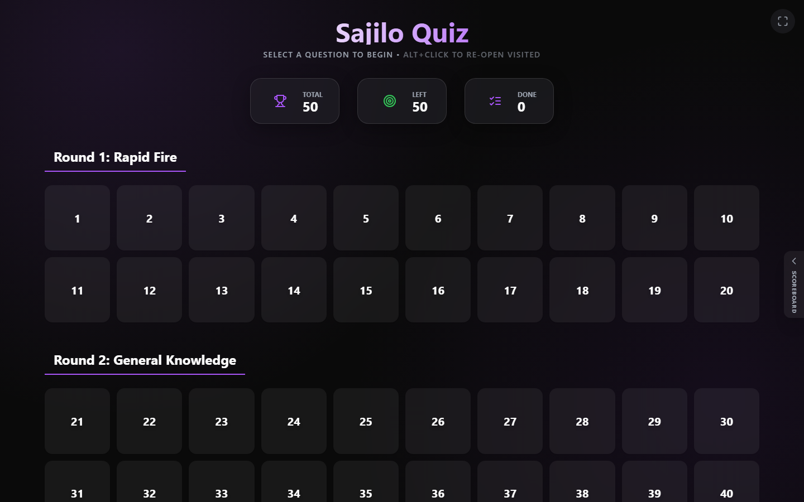
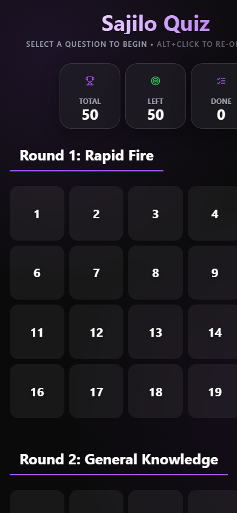
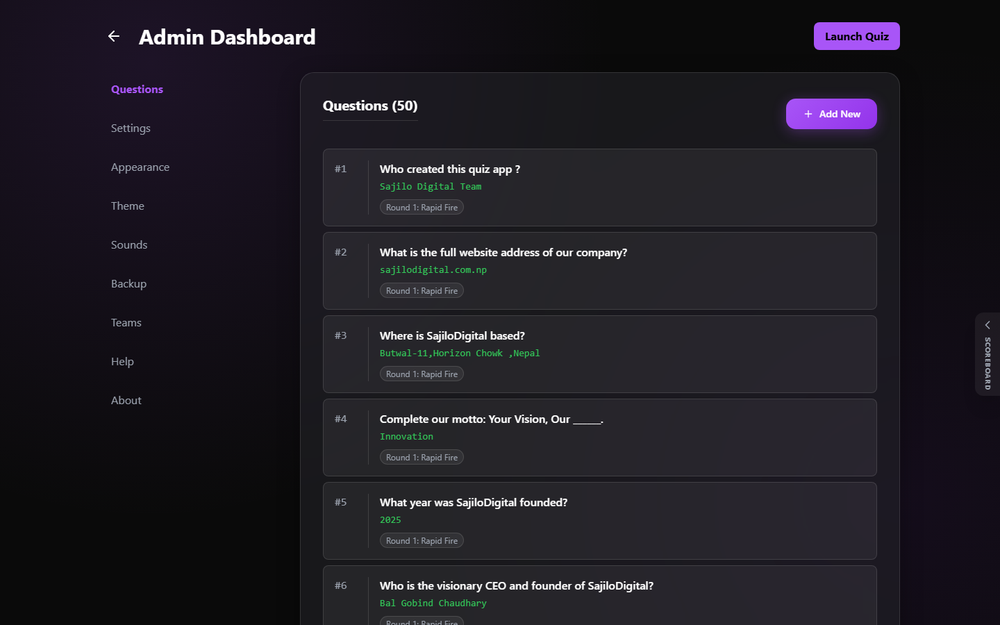

# Sajilo Quiz

A free, offline-first quiz presentation app for running live events. Build questions and rounds, project a question grid on the big screen, reveal answers one by one, and keep team scores in the sidebar. It works fully offline once loaded.

> The venue Wi-Fi will fail. You'll be ready.
>
> Built for quiz nights where the internet is the one thing that never shows up.
>
> No internet? No problem. That is the whole point.

---

## Quick Links

- **Live app:** https://sajiloquiz.vercel.app
- **Source:** https://github.com/arundada9000/sajiloquiz
- **Issues:** Open an issue or email the author (below)

---

## Screenshots

**Desktop - Question Grid**



**Mobile - Question Grid**



**Desktop - Admin Dashboard**



---

## Features

- **Offline first:** installable PWA. Everything, including your questions, images and sounds, runs with no internet.
- **Welcome onboarding:** a Quick Tour (auto-shows on first run, always available in the footer) walks new hosts through the grid, rounds, scoring, random/snap, themes, shortcuts and offline install in nine short steps.
- **Read aloud:** every question has a Read button that speaks the question (and the answer, once revealed) using offline speech synthesis.
- **Theme system:** eleven color schemes (Purple, Indigo, Blue, Teal, Green, Orange, Red, Pink, Cyan, Slate and a fully custom palette) with Light, Dark and Auto modes.
- **Sound effects:** a set of Web Audio generated sounds with a master toggle and individual controls.
- **Fullscreen:** press F to toggle fullscreen on any page.
- **Keyboard shortcuts and gestures:** press ? to see the full list. Touch devices get swipe and double-tap gestures.
- **Admin dashboard:** manage questions, configure rounds, brand the app, control themes and sounds, and back up your data.
- **Quick Peek:** press Q on any question for an overview grid of every question.
- **Random + Snap:** press R to jump to a random unvisited question, or X to "snap" away all visited questions (Thanos-style dust animation). A Restore button brings snapped questions back.
- **Per-question context menu:** right-click any grid card to open a menu for that question: open it, mark or unmark it as visited, mark it for review, or snap/restore just that one question.
- **Mark for review:** press M on any question to bookmark it (e.g. ambiguity). Marked questions get an amber badge on the grid.
- **Rounds:** group questions into rounds (Rapid Fire, General, etc.) or use a standard grid.
- **Multimedia:** embed images (auto-compressed to 800px JPEG) and audio (auto-converted to mono 16 kHz WAV).
- **Team scoreboard:** the sidebar tracks team scores as you call answers.
- **SEO / AEO / Geo ready:** structured data, Open Graph, Twitter cards and geo metadata driven by one config file.
- **FAQ page:** an in-app FAQ answers the most common questions, with matching FAQPage structured data in the meta tags.

---

## Setup and Installation

### Option 1: Development

```bash
npm install
npm run dev
```

### Option 2: Production build and local preview

```bash
npm run build
npm run preview
```

### Option 3: Install as an app (PWA)

1. Open the app in a supported browser (Chrome, Edge, or Safari).
2. Click the install button, or use the browser address-bar install icon.
3. Launch it from your home screen or taskbar like a native app.

---

## User Guide

- **Quick Tour:** on first visit the app opens a short onboarding that introduces the main features. You can replay it anytime from the footer (Quick Tour).
- **FAQ:** answers to the most common questions live on the [FAQ page](https://sajiloquiz.vercel.app/#/faq).

### Navigation

- **Grid view:** the main hub. Click a question number to open it.
- **Rounds:** with rounds enabled, questions appear grouped under round headers.
- **Question view:** shows the question and timer. Spacebar reveals the answer.
- **Back:** press ESC or the Back button to return to the grid.
- **Fullscreen:** press F anywhere.
- **Help:** press ? anywhere for shortcuts and gestures.

### Keyboard Shortcuts

**Global**

| Key | Action |
| :--- | :--- |
| **F** | Toggle fullscreen |
| **?** | Show / hide shortcuts and gestures |

**Grid page**

| Key | Action |
| :--- | :--- |
| **Alt + Click** | Re-open a visited question |
| **Double-click** | Open a question from the grid |
| **Right-click** | Open the per-question quick actions menu (mark/unmark visited, snap/restore) |
| **R** | Open a random unvisited question |
| **X** | Snap away all visited questions |

**Question page**

| Key | Action |
| :--- | :--- |
| **Space** | Reveal / hide answer |
| **Esc** | Back to grid / close modal |
| **Q** | Open quick peek overview |
| **T** | Start / pause timer |
| **R** | Reset timer |
| **M** | Mark / unmark the question |
| **+** / **]** | Increase text size |
| **-** / **[** | Decrease text size |
| **0** | Reset text size |
| **Read button** | Speak the question aloud (reads the answer too once revealed) |

### Touch Gestures (mobile)

| Gesture | Action |
| :--- | :--- |
| **Swipe left** | Go to the next question |
| **Swipe right** | Go to the previous question |
| **Double-tap** | Reveal / hide the answer |
| **Swipe up** | Toggle quick peek |
| **Right tap (long press)** | Open the per-question quick actions menu |

---

## Admin Guide

Open the Admin Panel from the Settings button in the footer.

### 1. Question Manager

- **Add:** create new questions, assigned to rounds automatically or manually.
- **Media:** upload images (auto-compressed to 800px JPEG) or audio (auto-converted to mono 16 kHz WAV).
- **Edit / Delete:** modify or remove existing questions. Duplicate IDs are rejected to keep data safe.

### 2. General Settings

- **Branding:** change the app name and company name.
- **Timer:** set default durations and auto-start behavior.
- **Rounds:** enable/disable rounds and define ranges (e.g. Round 1: Q1-10).

### 3. Appearance

- **Typography:** adjust font sizes for the grid, questions and answers.

### 4. Theme

- **Display mode:** Light, Dark, or Auto (follows the system).
- **Color scheme:** 11 schemes including a fully custom palette with a color picker. Changes apply instantly.

### 5. Sounds

- **Master control:** enable or disable all sounds at once.
- **Individual toggles:** control each sound separately.
- **Preview:** test a sound before enabling it.

### 6. Backup and Restore

- **Export:** download the whole quiz configuration as a .json file. Do this often.
- **Import:** restore a backup (drag and drop support).
- **Reset:** wipe all local data and return to defaults.
- **Storage:** monitor browser capability (the limit is usually around 5 MB).

---

## Legal and Support Pages

- **Privacy Policy:** in-app at the /#/privacy route.
- **Terms of Use:** in-app at the /#/terms route.
- **FAQ:** in-app at the /#/faq route.
- Links are in the footer of the grid and the About tab of Admin.

---

## Customization

### Central site configuration

All branding, URLs, social links, geo metadata and PWA settings live in one file:

```
src/config/site.ts
```

Edit it to rebrand or repoint the app. On the next build, the meta tags, Open Graph, Twitter cards, structured data (JSON-LD), robots.txt, sitemap.xml, PWA manifest, shortcuts and page content all update automatically. Nothing else needs to change.

### Icons

Replace the files in `public/icons/` (logo-favicon.png, logo-192.png, logo-512.png, logo-180.png) with your own logo.

### Themes

Use the built-in theme system in Admin, Theme tab, to restyle without touching code.

### Advanced

- Global styles: `src/index.css`
- Color schemes: `src/utils/theme.ts`
- Tailwind theme: `tailwind.config.js`

---

## Tech Stack

- React 18 + TypeScript
- Vite 5
- Tailwind CSS 3
- React Router 6
- Framer Motion
- vite-plugin-pwa (service worker)

---

## Project Structure

```
quiz/
|-- docs/screenshots/     # README screenshots
|-- public/               # static assets, icons, og-image
|-- src/
|   |-- components/       # UI components (modals, error boundary, onboarding, etc.)
|   |-- config/           # site.ts (single source of branding/URLs)
|   |-- context/          # data + quiz state management
|   |-- data/             # default config, sample questions, FAQ content
|   |-- hooks/            # shared React hooks (install prompt)
|   |-- pages/            # Grid, Question, Admin, Guide, Journal, FAQ, Privacy, Terms, Offline
|   |-- utils/            # theme, sounds, speech synthesis
|   |-- App.tsx           # routes
|   |-- main.tsx          # entry
|-- index.html            # meta + structured data (injected at build)
|-- vite.config.ts        # build config, PWA, SEO injection
```

---

## License

Proprietary. Not free for use. Every use requires written permission from the author or company. See [LICENSE](LICENSE) for the full terms.

---

## Author

**Arun Neupane** (CTO, Sajilo Digital)

- Portfolio: https://arunneupane.vercel.app
- Email: arunneupane0000@gmail.com
- Phone: +977 9842977207
- GitHub: https://github.com/arundada9000
- LinkedIn: https://www.linkedin.com/in/arundada9000
- X (Twitter): https://x.com/arundada9000
- YouTube: https://www.youtube.com/@arundada9000
- Instagram: https://www.instagram.com/arundada9000
- Facebook: https://www.facebook.com/arundada9000

---

## Team

| Role | Name |
| :--- | :--- |
| Chairperson | Pramod Chaudhary |
| CEO | Bal Gobind Chaudhary |
| CTO | Arun Neupane |
| QA | Sunil Paudyal |
| Frontend Developer | Bijay Kumar Chaudhary |
| Video Editor | Aashish GM |

---

Built by Arun Neupane - (c) 2026 All Rights Reserved
